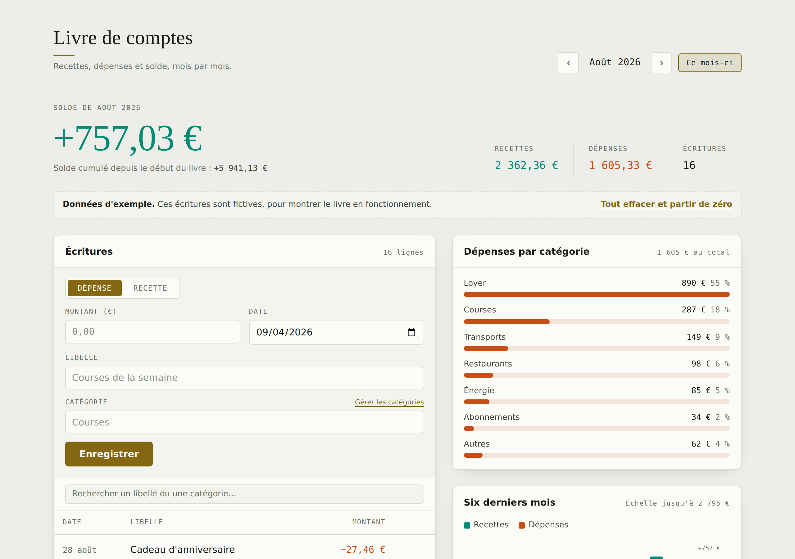

# Livre de comptes

Application de bureau pour tenir ses comptes : recettes, dépenses, solde du
mois et solde cumulé, avec la répartition par catégorie et l'évolution sur six
mois. Les écritures sont enregistrées dans un fichier sur votre ordinateur —
rien ne part sur Internet, il n'y a ni compte à créer ni connexion nécessaire.



## Lancer l'application

Il faut [Node.js](https://nodejs.org) (version 20 ou plus) installé.

```bash
cd livre-de-comptes
npm install     # une seule fois, télécharge Electron
npm start
```

## En faire une vraie application installable

Pour obtenir un `.dmg` (macOS), un installateur `.exe` (Windows) ou un
`.AppImage` (Linux) — à double-cliquer, sans passer par le terminal :

```bash
npm run build         # pour le système sur lequel vous êtes
npm run build:mac     # ou explicitement : mac / win / linux
```

Le résultat arrive dans `dist/`. La compilation doit se faire **sur** le
système visé : un `.dmg` se construit sur un Mac, un `.exe` sur Windows.
L'application n'est pas signée : au premier lancement, macOS demande de
confirmer via clic droit ▸ Ouvrir.

## Utilisation

**Saisir.** Choisissez Dépense ou Recette, tapez le montant (`24,90` ou
`24.90`, les deux passent), un libellé, une catégorie — la liste propose les
catégories connues, mais vous pouvez en saisir une nouvelle : elle rejoint
la liste automatiquement.

**Corriger.** Au survol d'une ligne, `✎` la reprend dans le formulaire et `×`
la supprime — avec une possibilité d'annuler pendant quelques secondes.

**Naviguer.** Les flèches passent d'un mois à l'autre, `Ce mois-ci` revient au
mois courant. Le champ de recherche filtre le mois affiché par libellé ou par
catégorie, sans tenir compte des accents ni des majuscules.

### Raccourcis

| Raccourci | Action |
| --- | --- |
| `⌘N` / `Ctrl+N` | Vider le formulaire pour une nouvelle écriture |
| `⌘F` / `Ctrl+F` | Aller au champ de recherche |
| `⌘K` / `Ctrl+K` | Ouvrir la gestion des catégories |
| `⌘←` `⌘→` | Mois précédent, mois suivant |
| `⌘T` / `Ctrl+T` | Revenir au mois courant |
| `⌘E` / `Ctrl+E` | Exporter le mois affiché en CSV |
| `⌘S` / `Ctrl+S` | Enregistrer une sauvegarde |
| `Échap` | Annuler la recherche, ou la modification en cours |

### Catégories

Deux listes indépendantes : celles de l'argent qui **sort** (dépenses) et
celles de l'argent qui **entre** (recettes). Un même nom peut exister des
deux côtés sans que les deux se mélangent.

Le lien *Gérer les catégories* sous le formulaire — ou **Livre ▸ Gérer les
catégories…** (`⌘K`) — ouvre la liste du sens choisi, avec le nombre
d'écritures qui utilisent chacune :

- **Ajouter** : un nom, le bouton `Ajouter`. Les doublons sont refusés, sans
  tenir compte des accents ni des majuscules (`energie` ne double pas
  `Énergie`).
- **Renommer** : cliquez dans le nom, corrigez, `Entrée`. Les écritures qui
  utilisaient l'ancien nom suivent — rien ne se retrouve orphelin. `Échap`
  annule la correction en cours.
- **Supprimer** : le `×` de la ligne. Si des écritures l'utilisent,
  l'application demande confirmation et les fait repasser dans « Divers ».
  Aucune écriture n'est perdue. « Divers » sert de repli et ne peut pas être
  supprimée.


### Import et export

Menu **Fichier** : export CSV du mois ou de tout le livre, import CSV,
sauvegarde et restauration au format JSON. Les catégories font partie de la
sauvegarde JSON ; un import CSV qui apporte des catégories inconnues les
ajoute à la liste du bon sens.

Le CSV exporté a cinq colonnes séparées par des points-virgules et un BOM
UTF-8, pour s'ouvrir directement dans Excel ou Numbers sans accents cassés :

```
Date;Type;Libellé;Catégorie;Montant
2026-09-04;Dépense;Supermarché;Courses;24,90
2026-09-02;Recette;Virement de salaire;Salaire;2380,00
```

L'import est plus tolérant que l'export : séparateur `;` ou `,`, dates
`2026-09-04` ou `04/09/2026`, montants avec virgule ou point. La colonne
`Type` est facultative — sans elle, un montant négatif est lu comme une
dépense et un montant positif comme une recette, ce qui correspond aux
exports de relevés bancaires. Les lignes illisibles sont écartées et
comptées ; les autres sont importées.

### Où sont mes données

Menu **Aide ▸ Où sont mes données ?** affiche le chemin exact. Selon le
système :

- macOS : `~/Library/Application Support/Livre de comptes/comptes.json`
- Windows : `%APPDATA%\Livre de comptes\comptes.json`
- Linux : `~/.config/Livre de comptes/comptes.json`

Chaque enregistrement écrit d'abord un fichier temporaire puis le renomme, et
conserve la version précédente en `.bak` : une coupure en cours de sauvegarde
ne peut pas laisser un fichier à moitié écrit. Si le fichier devient illisible,
il est mis de côté sous un nom `.corrompu-…` plutôt qu'écrasé, et l'app le
signale au démarrage.

Ce fichier reste votre sauvegarde la plus simple : copiez-le, ou passez par
Fichier ▸ Enregistrer une sauvegarde.

## Organisation du code

```
main.js              processus principal : fenêtre, menus, lecture/écriture du fichier
preload.js           le pont exposé à la page (window.compta), seule surface accessible
renderer/ledger.js   montants, agrégats, CSV — sans DOM, testable seul
renderer/app.js      rendu, formulaire, réactions aux menus
renderer/styles.css  thème clair et sombre, suit le réglage du système
test/                tests unitaires + démarrage réel de l'application
```

Les montants sont manipulés en **centimes entiers** : additionner trois cents
écritures ne fait pas dériver le total, ce qui arrive avec des nombres à
virgule flottante. La conversion en euros n'a lieu qu'à l'affichage et dans
le CSV.

La page est isolée du système : `contextIsolation` activé, `nodeIntegration`
désactivé, bac à sable actif, et une politique de sécurité de contenu qui
n'autorise que les fichiers locaux. Les libellés saisis sont insérés comme du
texte, jamais comme du HTML.

`renderer/index.html` s'ouvre aussi directement dans un navigateur : le
stockage bascule alors sur celui du navigateur et les exports deviennent des
téléchargements. Pratique pour un coup d'œil rapide, mais les données ne sont
pas les mêmes que celles de l'application.

## Tests

```bash
npm test        # logique du livre : montants, agrégats, CSV, validation
npm run test:app   # démarre réellement l'app, écrit une écriture, vérifie le fichier
```
